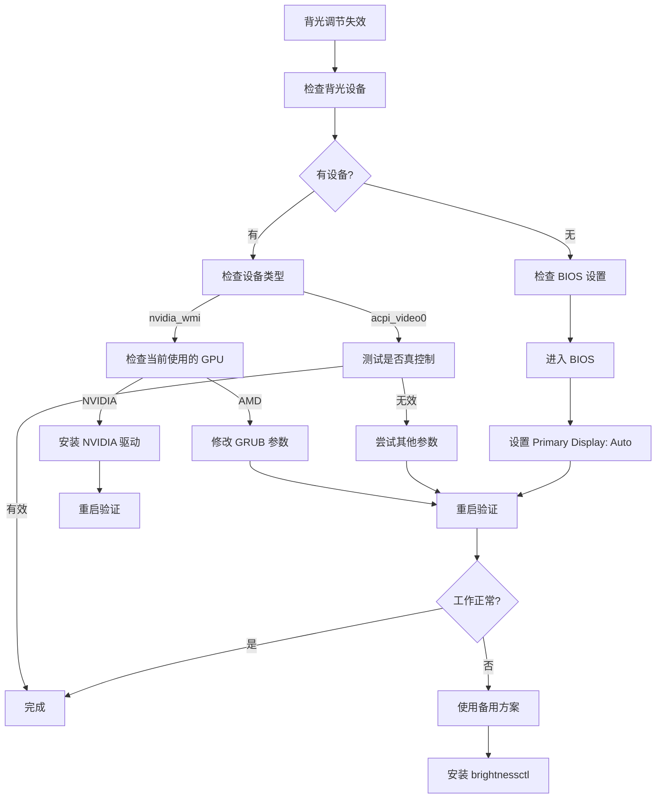

# 华硕笔记本 Linux 双显卡背光控制避坑指南

> **适用场景**: 华硕笔记本双显卡系统 (AMD 集显 + NVIDIA 独显) 在 Linux 下背光调节失效
> **测试系统**: Debian 12+ / Ubuntu 22.04+
> **最后更新**: 2025-12-29

---

## 🔍 问题快速诊断

在开始修复前,先确定你的问题类型:

### 诊断命令

```bash
# 1. 检查背光设备
ls /sys/class/backlight/

# 2. 检查显卡配置
lspci | grep -E "VGA|3D"

# 3. 检查当前显示服务
echo $XDG_SESSION_TYPE

# 4. 检查实际使用的 GPU
glxinfo | grep "OpenGL renderer" 2>/dev/null || sudo apt install mesa-utils && glxinfo | grep "OpenGL renderer"
```

### 常见问题类型

| 问题现象 | 背光设备 | 原因 | 解决方案 |
|---------|---------|------|---------|
| AMD 显卡但只有 `nvidia_wmi_ec_backlight` | NVIDIA 接口 | 双显卡不匹配 | [方案一](#方案一修复-grub-内核参数) |
| 有 `acpi_video0` 但调节无效 | ACPI 设备 | 参数不正确 | [方案二](#方案二尝试不同内核参数组合) |
| 完全没有背光设备 | 无 | BIOS 设置错误 | [方案三](#方案三检查-bios-设置) |
| 权限拒绝 | 任意设备 | udev 权限问题 | [方案四](#方案四修复-udev-权限) |

---

## 🚨 核心坑点总结

### 坑点 1: 双显卡背光接口错位 ⭐⭐⭐⭐⭐

**现象:**
- 系统使用 AMD 显卡输出显示
- 但背光设备却是 `nvidia_wmi_ec_backlight`
- NVIDIA 驱动未加载,导致无法控制

**检查方法:**
```bash
# 查看背光设备
ls /sys/class/backlight/
# 输出: nvidia_wmi_ec_backlight

# 查看实际使用的显卡
lspci | grep -i vga
# 输出: AMD Radeon 680M (或其他 AMD 集显)

# 查看内核模块
lsmod | grep nvidia
# 输出: 只有 nvidia_wmi_ec_backlight,没有 nvidia 驱动
```

**解决方案:** → [方案一](#方案一修复-grub-内核参数)

---

### 坑点 2: `acpi_backlight=video` 创建了假设备 ⭐⭐⭐⭐

**现象:**
- 修改 GRUB 后出现了 `acpi_video0`
- 可以写入数值但屏幕亮度不变
- `cat /sys/class/backlight/acpi_video0/actual_brightness` 显示数值变化

**原因:**
`acpi_backlight=video` 创建的 ACPI 设备可能不是真正的硬件背光控制器,只是软件模拟层。

**解决方法:**
改用 `acpi_backlight=native` 或 `acpi_backlight=vendor`

```bash
# 修改 GRUB
GRUB_CMDLINE_LINUX_DEFAULT="quiet acpi_backlight=native"
```

---

### 坑点 3: GRUB 修改后未生效 ⭐⭐⭐⭐

**现象:**
- 修改了 `/etc/default/grub`
- 执行了 `update-grub`
- 重启后 `cat /proc/cmdline` 还是旧参数

**检查方法:**
```bash
# 1. 确认配置文件
cat /etc/default/grub | grep GRUB_CMDLINE_LINUX_DEFAULT

# 2. 确认 grub.cfg 已更新
grep "你的参数" /boot/grub/grub.cfg

# 3. 如果上面没有输出,手动重新生成
sudo grub-mkconfig -o /boot/grub/grub.cfg
```

**解决方案:**
```bash
# 完整更新流程
sudo nano /etc/default/grub          # 修改配置
sudo update-grub                     # 生成 grub.cfg
sudo grep "参数" /boot/grub/grub.cfg # 验证
sudo reboot                          # 重启
```

---

### 坑点 4: udev 规则失效 ⭐⭐⭐

**现象:**
- 每次重启后背光设备权限又变回只读
- 需要手动 `sudo chmod` 才能调节

**原因:**
udev 规则条件不匹配或规则文件位置错误

**解决方法:**
```bash
# 创建正确的 udev 规则
sudo nano /etc/udev/rules.d/80-backlight.rules
```

添加内容:
```bash
ACTION=="add", SUBSYSTEM=="backlight", RUN+="/bin/chgrp video /sys/class/backlight/%k/brightness"
ACTION=="add", SUBSYSTEM=="backlight", RUN+="/bin/chmod g+w /sys/class/backlight/%k/brightness"
```

重新加载:
```bash
sudo udevadm control --reload-rules
sudo udevadm trigger -c add -s backlight
```

---

### 坑点 5: Wayland 下某些工具不工作 ⭐⭐⭐

**现象:**
- `xbacklight` 命令报错
- `xrandr --brightness` 改变的是软件层面,不降低功耗

**原因:**
Wayland 使用不同的显示协议,X11 工具可能不兼容

**解决方法:**
使用 Wayland 兼容的工具:
```bash
# 安装 brightnessctl (Wayland 友好)
sudo apt install brightnessctl
brightnessctl set 50%
```

---

### 坑点 6: ASUS 笔记本特殊 WMI 驱动 ⭐⭐⭐

**现象:**
- 尝试所有内核参数都不行
- `dmesg | grep backlight` 显示 `asus_wmi` 错误

**检查方法:**
```bash
# 查看 asus_wmi 模块状态
lsmod | grep asus

# 查看内核日志
sudo dmesg | grep -i "asus\|backlight" | tail -20
```

**解决方法:**
```bash
# 1. 确保 asus-nb-wmi 模块加载
sudo modprobe asus_nb_wmi

# 2. 添加到 /etc/modules (开机自动加载)
echo "asus_nb_wmi" | sudo tee -a /etc/modules

# 3. 尝试专用内核参数
GRUB_CMDLINE_LINUX_DEFAULT="quiet acpi_backlight=vendor asus_wmi"
```

---

## 🛠️ 完整解决方案

### 方案一: 修复 GRUB 内核参数 (推荐)

**适用情况:** 双显卡系统,背光接口不匹配

#### 步骤 1: 备份原配置

```bash
sudo cp /etc/default/grub /etc/default/grub.backup
```

#### 步骤 2: 修改 GRUB 配置

```bash
sudo nano /etc/default/grub
```

找到这一行:
```
GRUB_CMDLINE_LINUX_DEFAULT="quiet"
```

**根据你的情况选择:**

**选项 A - AMD 显卡为主 (推荐):**
```
GRUB_CMDLINE_LINUX_DEFAULT="quiet acpi_backlight=native amdgpu.backlight=0"
```

**选项 B - 禁用 NVIDIA WMI 背光:**
```
GRUB_CMDLINE_LINUX_DEFAULT="quiet nvidia_wmi_ec_backlight=0 acpi_backlight=native"
```

**选项 C - 使用 vendor 方式:**
```
GRUB_CMDLINE_LINUX_DEFAULT="quiet acpi_backlight=vendor"
```

**选项 D - 通用方案:**
```
GRUB_CMDLINE_LINUX_DEFAULT="quiet acpi_backlight=video"
```

#### 步骤 3: 保存并更新

```bash
# 按 Ctrl+O 保存, Ctrl+X 退出

# 更新 GRUB
sudo update-grub

# 验证是否写入成功
sudo grep "acpi_backlight" /boot/grub/grub.cfg
```

#### 步骤 4: 重启验证

```bash
sudo reboot
```

重启后检查:
```bash
# 查看内核参数
cat /proc/cmdline

# 查看背光设备
ls /sys/class/backlight/

# 测试调节
echo 50 > /sys/class/backlight/*/brightness
```

---

### 方案二: 尝试不同内核参数组合

**适用情况:** `acpi_video0` 存在但不工作

#### 快速测试脚本

```bash
#!/bin/bash
# 测试不同内核参数

PARAMS=(
    "acpi_backlight=native"
    "acpi_backlight=vendor"
    "acpi_backlight=video"
    "nvidia_wmi_ec_backlight=0 acpi_backlight=native"
    "amdgpu.backlight=0"
)

echo "将依次测试以下参数组合:"
echo "----------------------------------------"

for i in "${!PARAMS[@]}"; do
    echo "$((i+1)). ${PARAMS[$i]}"
done

echo ""
echo "请手动修改 /etc/default/grub 测试每个选项"
```

**推荐测试顺序:**
1. `acpi_backlight=native` + `amdgpu.backlight=0`
2. `acpi_backlight=vendor`
3. `nvidia_wmi_ec_backlight=0` + `acpi_backlight=native`
4. `acpi_backlight=video`

---

### 方案三: 检查 BIOS 设置

**适用情况:** 完全没有背光设备

#### 进入 BIOS

```
1. 完全关机 (不是重启)
2. 按电源键开机,立即不断按 F2 或 Del 键
3. 进入 BIOS 设置界面
```

#### 查找显卡设置

**华硕笔记本常见位置:**

**方案 A (最常见):**
```
Advanced → System Agent Configuration
    → Graphics Configuration
        → Primary Display: [Auto]
        → iGPU Multi-Monitor: [Enabled]
```

**方案 B:**
```
Advanced → Graphics Configuration
    → Primary Display: [Auto]
```

**方案 C:**
```
Boot → Graphics Configuration
    → Primary Display: [Auto]
```

**关键设置说明:**
- **选择 Auto**: 让系统自动选择 AMD 作为主显示 GPU
- 不要选择 CPU Graphics (完全禁用独显)
- 不要选择 PEG/PCI Express (只用独显)

#### 保存并退出

- 按 **F10** 保存并退出
- 确认保存 (Yes/OK)
- 系统会重启

---

### 方案四: 修复 udev 权限

**适用情况:** 每次重启后权限丢失

#### 步骤 1: 检查当前权限

```bash
ls -la /sys/class/backlight/*/brightness
```

期望输出:
```
-rw-rw-r-- 1 root video 4096 ... brightness
```

如果不正确 (显示 `-rw-r--r--`),执行以下步骤。

#### 步骤 2: 创建 udev 规则

```bash
sudo nano /etc/udev/rules.d/80-backlight.rules
```

添加内容:
```bash
ACTION=="add", SUBSYSTEM=="backlight", RUN+="/bin/chgrp video /sys/class/backlight/%k/brightness"
ACTION=="add", SUBSYSTEM=="backlight", RUN+="/bin/chmod g+w /sys/class/backlight/%k/brightness"
```

#### 步骤 3: 重新加载规则

```bash
sudo udevadm control --reload-rules
sudo udevadm trigger -c add -s backlight
```

#### 步骤 4: 立即应用权限

```bash
# 手动设置一次
sudo chgrp video /sys/class/backlight/*/brightness
sudo chmod g+w /sys/class/backlight/*/brightness
```

#### 步骤 5: 验证

```bash
# 重启后检查
ls -la /sys/class/backlight/*/brightness

# 测试普通用户调节
echo 50 > /sys/class/backlight/*/brightness
```

---

## 🔧 备用解决方案

### 方案 A: 使用 brightnessctl

**适用情况:** 硬件背光无法工作,需要软件方案

```bash
# 安装
sudo apt install brightnessctl

# 使用
brightnessctl set 50%
brightnessctl set +10%  # 增加
brightnessctl set 10%-  # 减少

# 列出所有设备
brightnessctl -l

# 指定设备
brightnessctl -d acpi_video0 set 50%
```

---

### 方案 B: 使用 xrandr (软件层面)

**适用情况:** 仅需要临时降低屏幕亮度

**注意:** 不降低功耗,只是软件层面调整

```bash
# 查看连接的显示器
xrandr

# 降低亮度 (0.3-1.0)
xrandr --output eDP-1 --brightness 0.5

# 恢复正常
xrandr --output eDP-1 --brightness 1.0
```

**创建快捷脚本:**
```bash
#!/bin/bash
# ~/.brightness.sh

case $1 in
    up)
        xrandr --output eDP-1 --brightness 1.0
        ;;
    down)
        xrandr --output eDP-1 --brightness 0.5
        ;;
    *)
        echo "用法: $0 {up|down}"
        ;;
esac
```

---

### 方案 C: DDC/CI (外部显示器)

**适用情况:** 外接显示器背光控制

```bash
# 安装
sudo apt install ddcutil

# 设置亮度为 50%
ddcutil setvcp 10 50

# 查询当前亮度
ddcutil getvcp 10

# 增加亮度
ddcutil setvcp 10 + 20
```

---

## 📋 完整诊断流程

当你遇到背光问题时,按此流程排查:



---

## ✅ 成功验证清单

修复完成后,验证以下项目:

- [ ] `/sys/class/backlight/` 下有正确的设备
- [ ] `cat /proc/cmdline` 显示新的内核参数
- [ ] 背光设备权限正确 (`ls -la /sys/class/backlight/*/brightness`)
- [ ] 可以直接写入亮度值: `echo 50 > /sys/class/backlight/*/brightness`
- [ ] 普通用户 (非 root) 可以调节
- [ ] 键盘快捷键功能键 (Fn + 亮度键) 工作
- [ ] 重启后设置依然有效

---

## 🎯 针对不同笔记本品牌的特殊参数

### 华硕 (ASUS)
```bash
GRUB_CMDLINE_LINUX_DEFAULT="quiet acpi_backlight=vendor asus_wmi"
GRUB_CMDLINE_LINUX_DEFAULT="quiet acpi_backlight=native"
```

### 联想 (Lenovo)
```bash
GRUB_CMDLINE_LINUX_DEFAULT="quiet acpi_backlight=thinkpad_acpi"
GRUB_CMDLINE_LINUX_DEFAULT="quiet acpi_backlight=native"
```

### 戴尔 (Dell)
```bash
GRUB_CMDLINE_LINUX_DEFAULT="quiet acpi_backlight=dell"
GRUB_CMDLINE_LINUX_DEFAULT="quiet acpi_backlight=native"
```

### 惠普 (HP)
```bash
GRUB_CMDLINE_LINUX_DEFAULT="quiet acpi_backlight=hp"
GRUB_CMDLINE_LINUX_DEFAULT="quiet acpi_backlight=vendor"
```

---

## 📚 参考资源

### 内核参数文档
- [内核参数: acpi_backlight](https://www.kernel.org/doc/html/latest/admin-guide/kernel-parameters.html)
- [AMDGPU 驱动参数](https://www.kernel.org/doc/html/latest/gpu/amdgpu.html)

### 相关工具
- [brightnessctl GitHub](https://github.com/Hummer12007/brightnessctl)
- [ddcutil 官方文档](https://www.ddcutil.com/)

### 社区资源
- [Arch Wiki - Backlight](https://wiki.archlinux.org/title/backlight)
- [Ubuntu Forums - Laptop Brightness](https://ubuntuforums.org/)

---

## 🔍 常见错误信息速查

| 错误信息 | 原因 | 解决方法 |
|---------|------|---------|
| `echo: write error: Invalid argument` | 亮度值超出范围 | 检查 `max_brightness` |
| `Permission denied` | 权限问题 | [方案四](#方案四修复-udev-权限) |
| `No backlight device found` | 无背光设备 | [方案三](#方案三检查-bios-设置) |
| `nvidia-smi: command not found` | NVIDIA 驱动未安装 | 不影响 AMD 显卡亮度 |
| `xbacklight: No outputs have backlight property` | Wayland 不兼容 | 使用 brightnessctl |

---

## 💡 最佳实践建议

1. **每次修改 GRUB 后都要验证:**
   ```bash
   grep "参数" /boot/grub/grub.cfg
   ```

2. **测试参数时建议顺序:**
   - native → vendor → video → none

3. **保留备份:**
   ```bash
   sudo cp /etc/default/grub /etc/default/grub.backup
   ```

4. **记录工作配置:**
   一旦找到工作的参数,记录下来防止忘记

5. **双显卡系统建议:**
   - 优先使用 AMD 集显作为主显示 (省电)
   - NVIDIA 独显用于计算任务 (CUDA)
   - 参考本目录下的 [gpu-hybrid-setup.md](./gpu-hybrid-setup.md)

---

## 🆘 仍然无法解决?

### 收集诊断信息

```bash
# 创建诊断报告
{
    echo "=== 背光设备 ==="
    ls -la /sys/class/backlight/

    echo -e "\n=== 显卡信息 ==="
    lspci | grep -E "VGA|3D"

    echo -e "\n=== 内核参数 ==="
    cat /proc/cmdline

    echo -e "\n=== 加载的模块 ==="
    lsmod | grep -E "nvidia|amdgpu|video|backlight"

    echo -e "\n=== GRUB 配置 ==="
    cat /etc/default/grub | grep GRUB_CMDLINE_LINUX_DEFAULT

    echo -e "\n=== 内核日志 (背光相关) ==="
    sudo dmesg | grep -i backlight | tail -20

} > ~/backlight-diag.txt
```

### 寻求帮助时提供

1. 笔记本品牌和型号
2. `~/backlight-diag.txt` 内容
3. 尝试过的解决方案
4. 当前 `/etc/default/grub` 配置

---

**文档版本**: v1.0
**适用系统**: Debian 12+, Ubuntu 22.04+, 其他基于 Debian 的发行版
**测试环境**: 华硕笔记本 AMD 680M + NVIDIA 双显卡

---

## 快速修复脚本 (一键执行)

**谨慎使用! 先理解脚本内容再执行!**

```bash
#!/bin/bash
# 快速修复脚本 - 备份原配置并应用推荐的内核参数

echo "华硕笔记本背光修复脚本"
echo "======================"

# 1. 备份
echo "[1/5] 备份原 GRUB 配置..."
sudo cp /etc/default/grub /etc/default/grub.backup.$(date +%Y%m%d_%H%M%S)

# 2. 修改配置
echo "[2/5] 修改 GRUB 配置..."
sudo sed -i 's/^GRUB_CMDLINE_LINUX_DEFAULT="quiet"/GRUB_CMDLINE_LINUX_DEFAULT="quiet acpi_backlight=native amdgpu.backlight=0"/' /etc/default/grub

# 3. 验证
echo "[3/5] 验证配置..."
cat /etc/default/grub | grep GRUB_CMDLINE_LINUX_DEFAULT

# 4. 更新 GRUB
echo "[4/5] 更新 GRUB..."
sudo update-grub

# 5. 创建 udev 规则
echo "[5/5] 创建 udev 权限规则..."
echo 'ACTION=="add", SUBSYSTEM=="backlight", RUN+="/bin/chgrp video /sys/class/backlight/%k/brightness"
ACTION=="add", SUBSYSTEM=="backlight", RUN+="/bin/chmod g+w /sys/class/backlight/%k/brightness"' | sudo tee /etc/udev/rules.d/80-backlight.rules

sudo udevadm control --reload-rules
sudo udevadm trigger -c add -s backlight

echo ""
echo "✅ 完成! 请重启系统: sudo reboot"
echo "如果重启后还不工作,请尝试文档中的其他方案"
```

使用方法:
```bash
# 保存脚本
nano ~/fix-backlight.sh

# 粘贴上面的内容,保存退出

# 添加执行权限
chmod +x ~/fix-backlight.sh

# 执行
bash ~/fix-backlight.sh
```

---

**祝你好运! 🍀**
